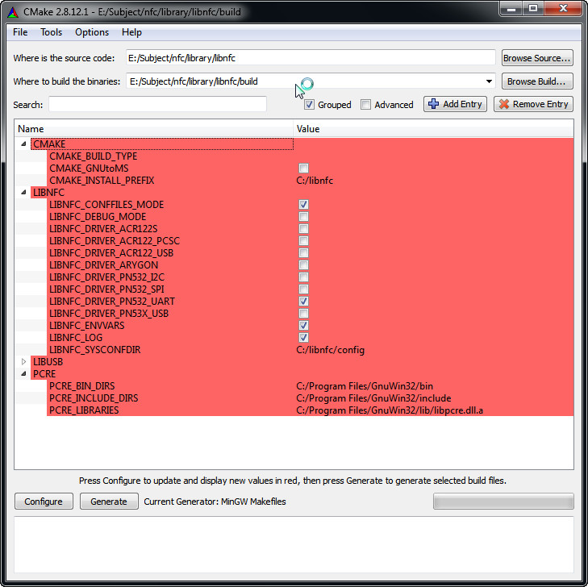
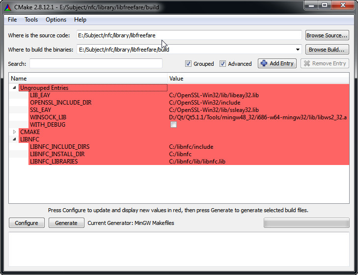

#GNFC
GNFC is a OpenSource GUI NFC tool which is based on QT and several nfc libraries(libnfc/libfreefare/libllcp/libndef), it aims at showing you how to use [ELECHOUSE USB NFC Device](http://elechouse.com) to read card and write card.  
[ELECHOUSE USB NFC Device](http://elechouse.com) is based on PN532, it has an MCU and a beeper inside, user can send command(in PN532 frame format) to control beeper, the command value to control beeper is **0xA0**, after receive the `BEEP` command [ELECHOUSE USB NFC Device](http://elechouse.com) won't send ack package.

## Dependence

+ [libnfc](https://code.google.com/p/libnfc/)
+ [libfreefare](https://code.google.com/p/libfreefare/)
+ [libllcp](https://code.google.com/p/libllcp/)
+ [libndef](https://github.com/nfc-tools/libndef)
+ [QT5](http://qt-project.org/)

## Compile Environment

### Windows

There is a pre-build binary file. [Download](https://github.com/JiapengLi/GNFC/releases/download/v0.1.1/gnfc-0.1.1-win.zip)

*Note: So far libllcp does not support Windows platform.*

#### Tools
Some tools is needed to compile libnfc and libfreefare.  

+ [Win32OpenSSL](http://slproweb.com/download/Win32OpenSSL-1_0_1e.exe)
+ [PCRE](http://hivelocity.dl.sourceforge.net/project/gnuwin32/pcre/7.0/pcre-7.0.exe)
+ [cmake](http://www.cmake.org/files/v2.8/cmake-2.8.12.1-win32-x86.exe)

Install all of these tools.

#### QT5
Install [QT5.1.1](http://download.qt-project.org/official_releases/qt/) or high.

To build libnfc and libfreefare, we use the MinGW tool chain of QT, so add
`Qt/Qt5.1.1/Tools/mingw48_32/bin` to environment variable `PATH`

#### libnfc
[A detailed instruction to compile libnfc under Windows](http://www.mobilefish.com/developer/libnfc/libnfc.html)

#### libfreefare
Use cmake to configure libfreefare,  then generate Makefile for it.

*Install programs by default and set parameter like pictures above may save some time.* 

### Linux

#### QT5

1. Download [`qt-linux-opensource-5.x.x-x86-offline.run`](http://download.qt-project.org/official_releases/qt/)
2. `sudo chmod +x qt-linux-opensource-5.1.1-x86-offline.run`
3. `./qt-linux-opensource-5.1.1-x86-offline.run`
4. next...next...next...
5. (Optional) Fix startup error. [See Reference](http://askubuntu.com/questions/253785/cannot-overwrite-file-home-baadshah-config-qtproject-qtcreator-toolchains-xml)

        sudo -s chmod o+w /home/yourname/.config/QtProject/qtcreator/*.x
        sudo chown -R $USER:$USER /home/lich/.config/QtProject/

#### libnfc

	autoreconf -vis
	./configure --with-drivers=pn532_uart --sysconfdir=/etc --prefix=/usr
	make
	sudo make install all

#### libfreefare
	
	autoreconf -vis
	./configure --prefix=/usr
	make
	sudo make install

#### libllcp
	
	autoreconf -vis
	./configure --prefix=/usr
	make
	sudo make install

#### libndef
	
	qmake PREFIX=/usr
	make
	sudo make install

## GNFC
After all are prepared done. Download the GNFC source code, open the `gnfc.pro` with QT Creator, compile and run it.

### Windows
For windows, the dll files below may be needed. Different QT may be different here.

	./icudt51.dll
	./icuin51.dll
	./icuuc51.dll
	./libeay32.dll
	./libfreefare.dll
	./libgcc_s_dw2-1.dll
	./libnfc.dll
	./libstdc++-6.dll
	./libwinpthread-1.dll
	./pcre3.dll
	./Qt5Core.dll
	./Qt5Gui.dll
	./Qt5SerialPort.dll
	./Qt5Widgets.dll

	./platforms/qwindows.dll

### Linux